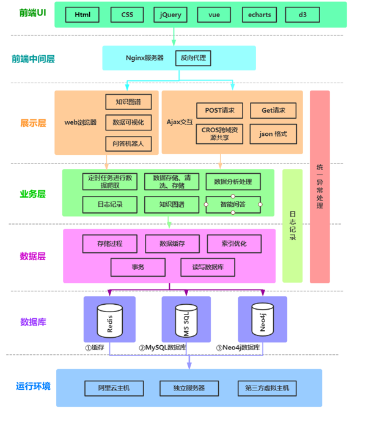
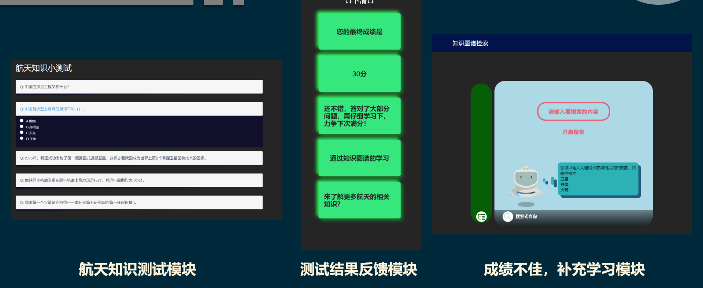
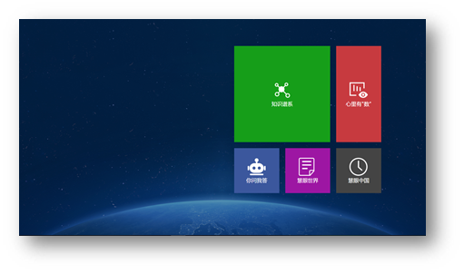

# 基于知识图谱的航天数据可视化系统

> 基于知识图谱的航天数据可视化系统，采用多元化的数据展示方式，对数据进行分析处理后展示。

该项目是参加全国计算机设计大赛的作品，很遗憾没能够杀出重围，但是通过这个项目我学习到了关于数据可视化和知识图谱方面的知识，这些收获也能弥补一些遗憾吧。😔

## 应用背景

当今航天科普网站存在以下问题：

* **科技新闻高深难理解**
* **数据表现形式单调，视觉冲击感不够**
* **方式单一难以激发热情**
* **体会感悟不够深刻强烈**

项目背景意义：

* **一个理念：**让航天知识深入人心， 感受到祖国航天事业的强大
* **两个观念：**标新立异出类拔萃、信息可靠数据准确
* **五个实现：**知识图谱、你问我答、慧眼世界、慧眼中国、心里有数

## 项目架构

## 核心技术

### 知识图谱的构建

1. 利用**webMagic**爬虫框架结合定时任务动态爬取数据并且存储到 **.csv** 后缀的文件中。

2. 从文件中读取数据进行清洗过滤，采用面向对象的思想，建立起核心三元组的概念(实体、属性、关系)。

3. 运用**ORM**框架实现实体对象到**图像数据库Neo4j**的映射，进行数据持久化存储。

   

### 知识测试系统构建

1. 航天问题库爬取；
2. 航天问题随机展示；
3. 用户回答问题并提交；
4. 服务器统计热点问题；
5. 答案判别回复。

## 界面展示

**主页(模块可自由滑动)**

**问题测试**

**知识图谱**

**你问我答(交互式智能机器人)**

**慧眼中国(中国航天历程)**

**心里有数(数据可视化)**

## 总结与展望

这次的项目方向以及选题是航天相关，做之前对航天了解不多，只知道发射了哪些火箭等等，想着这个方面应该是一个亮点。后来从构思到基本架构定下来花了大概3天时间，我和队友也一直在软件和可视化两个方向徘徊。最后选定可视化，那就开干，我负责后端，队友负责前端。航天数据真的很难收集 😫，那几天整个人是绝望的。还好后来渐渐地找到了一些数据(甚至翻到韩国网站去了.....)。数据确定后我就开始系统搭建，这部分还是比较顺利的，可是问题就卡在了知识图谱那里了，这个东西第一次做，人有点懵，后来和队友一起弄这个，找了些相关算法资料边弄边整最后竟然整出来了。没拿到奖，很难受啊很难受啊很难受。

东西学到手了，奖没有，还能咋样，就这样呗 🐻

